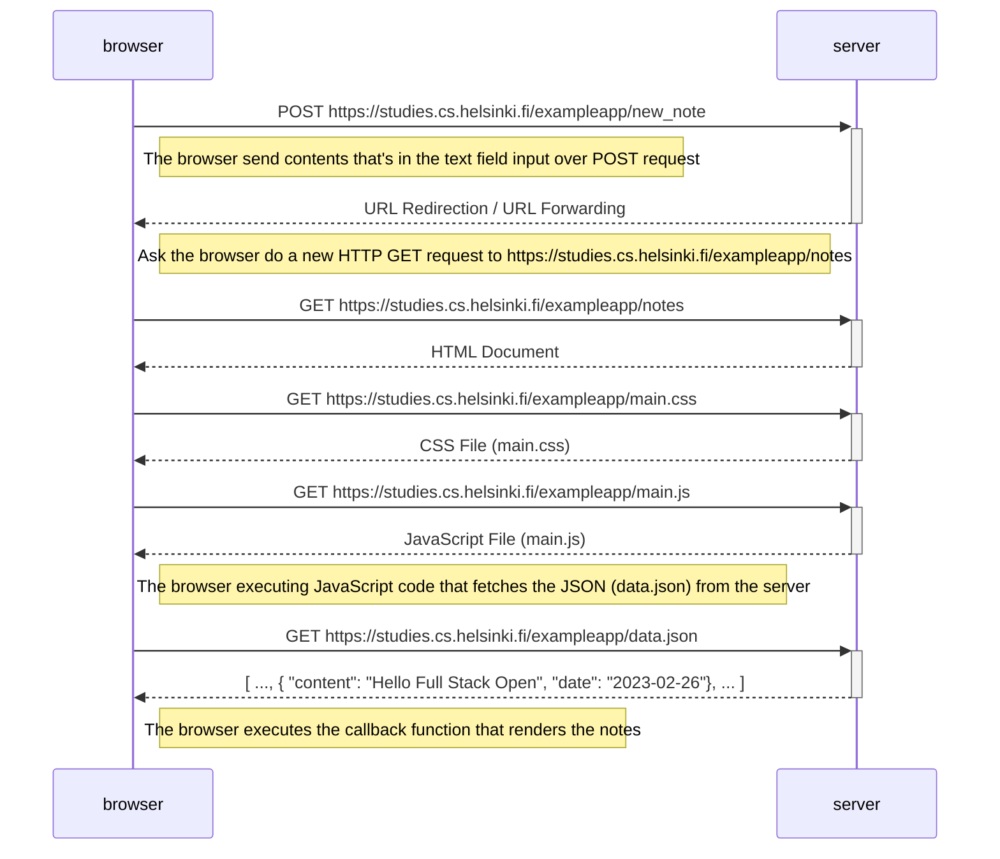

```mermaid
sequenceDiagram
participant browser
participant server

browser->>+server: POST https://studies.cs.helsinki.fi/exampleapp/new_note
    Note right of browser: The browser send contents that's in the text field input over POST request

    server-->>-browser: URL Redirection / URL Forwarding
    Note left of server:  Ask the browser do a new HTTP GET request to https://studies.cs.helsinki.fi/exampleapp/notes

    browser->>+server: GET https://studies.cs.helsinki.fi/exampleapp/notes
    server-->>-browser: HTML Document

    browser->>+server: GET https://studies.cs.helsinki.fi/exampleapp/main.css
    server-->>-browser: CSS File (main.css)

    browser->>+server: GET https://studies.cs.helsinki.fi/exampleapp/main.js
    server-->>-browser: JavaScript File (main.js)

    Note right of browser: The browser executing JavaScript code that fetches the JSON (data.json) from the server

    browser->>+server: GET https://studies.cs.helsinki.fi/exampleapp/data.json
    server-->>-browser: [ ..., { "content": "Hello Full Stack Open", "date": "2023-02-26"}, ... ]

    Note right of browser: The browser executes the callback function that renders the notes
```
