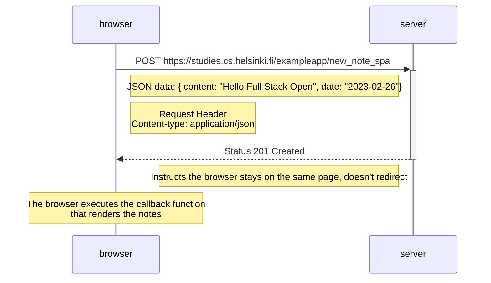

```mermaid
sequenceDiagram
participant browser
participant server

    browser->>+server: POST https://studies.cs.helsinki.fi/exampleapp/new_note_spa
    Note right of browser: JSON data: { content: "Hello Full Stack Open", date: "2023-02-26"}
    Note right of browser: Request Header<br>Content-type: application/json
    server-->>-browser: Status 201 Created
    Note left of server: Instructs the browser stays on the same page, doesn't redirect
    Note over browser: The browser executes the callback function<br>that renders the notes
```
